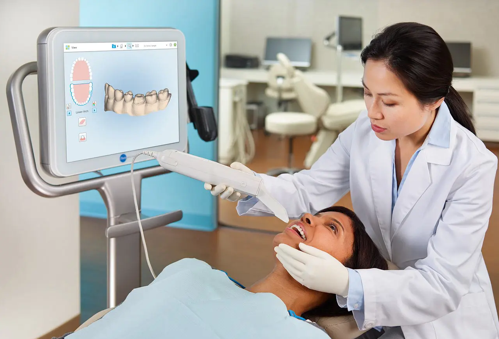
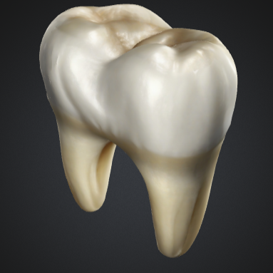
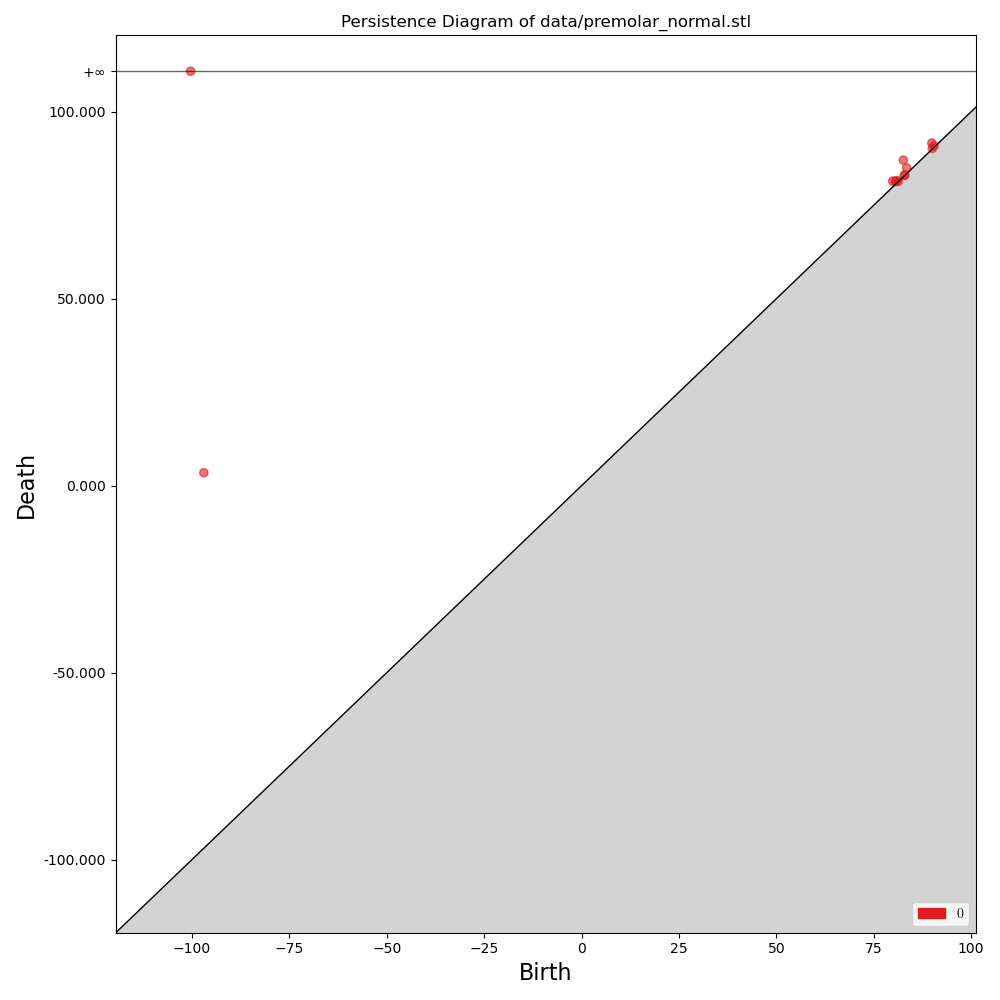
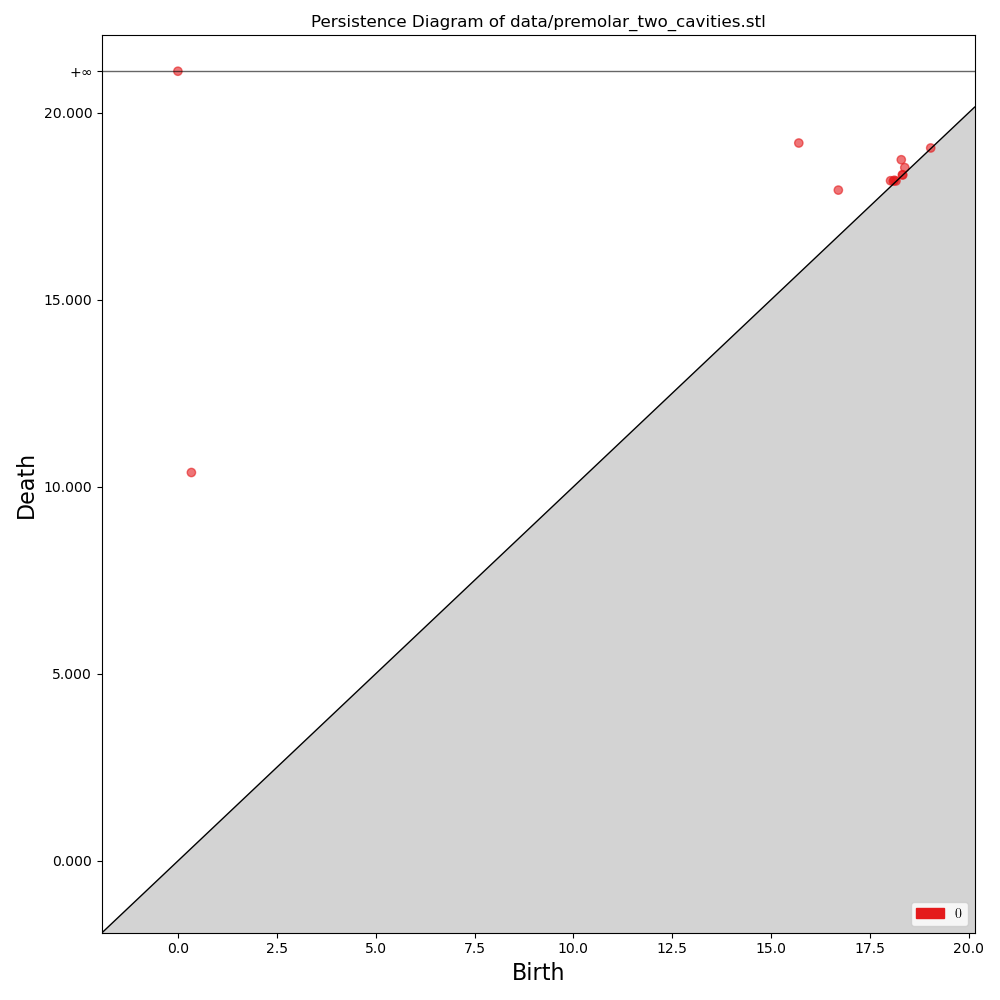

# Dentology: Topological Data Analysis for Dentists 🦷


**Dentology** – *"Filling the hole in dental care since 2025."*

Dentology is a cutting-edge tool for dentists that uses Topological Data Analysis (TDA) to analyze digital tooth twins. It provides state-of-the-art tools for cavity detection and teeth counting. Dentology is designed to help dentists make better decisions and improve patient care, while also saving time and resources. In other words, Dentology is the tooth fairy of the 21st century where the coins have been replaced with value-added insights.

## Cavity Detection Pipeline

The main feature of Dentology is the Cavity Detection Pipeline (CDP): A SoTA tool for identifying various types of cavities. It uses Topological Data Analysis (TDA) to detect cavities in a patient's teeth.

The workflow of the CDP is extremely simple and can be summarized in three steps: 

1. **Feature Extraction**: 3D scan the patient's tooth to create a digital model.
2. **Cavity Detection**: Run the Cavity Detection Pipeline in Dentology.
3. **Analysis**: Analyze the persistence diagram to identify cavities in the tooth.

||
|:--:|
|**Figure:** A dentist 3D scanning a patient's tooth to create a digital model using an [iTero](https://www.itero.com/) intraoral scanner ([image source](https://arizonabraces.com/how-does-itero-scanner-work/)).|

If you do not have access to an intraoral scanner, you can extract the tooth from the patient and have someone model it in a CAD software. Just remember to ask the patient for permission before extracting their tooth and to return it after the modeling is done.

### Mathematical Background

Let $X$ be a topological space and $f\colon X\to\mathbb{R}$ a function. We consider the filtration $T(X,f)$ of $X$ induced by $f$ given in filtration degree $r\in\mathbb{R}$ as $f^{-1}((-\infty,r])$. That is, $T(X,f)_r$ is the sublevel set of $f$ at level $r$. We are then interested in computing the persistent homology of the filtration $T(X,f)$. 

In the context of cavity detection, we consider a tooth as a 3D model $X\subseteq\mathbb{R}^ 3$. Since we only care about the zero-dimensional persistent homology, we consider $X$ as the wireframe (i.e., $1$-skeleton) of the tooth embedded in $\mathbb{R}^3$. So we have a $1$-dimensional geometric simplicial complex representing the tooth. Let $X_k$ denote the $k$-skeleton of $X$. We define $f\colon X\to\mathbb{R}$ from a function $f_0\colon X_0\to\mathbb{R}$ on the vertices as $f(\sigma) = \max_{x\in\sigma} f_0(x)$. The filtration $T(X,f)$ is then given by

$$
T(X,f)_r = \left\lbrace\sigma\in X\mid f_0(x)\leq r\text{ for all }x\in\sigma\right\rbrace.
$$

In the implementation, we use the projection $f_0(x,y,z)=z$ to detect cavities on the tooth surface (pit and fissure cavities). The projections $f_0(x,y,z)=x$ and $f_0(x,y,z)=y$ can be used to to detect smooth surface cavities and root cavities.

### Implementation Details

Dentology uses Trimesh to load the 3D model and get the (unique) edges. The filtration $T(X,f)$ is constructed, and Gudhi is used to compute the persistent homology. The persistence diagram is then plotted for analysis.

---

## Installation and Usage

### Clone the repository:

```bash
git clone https://github.com/odinhg/Dentology-TDA-for-Dentists 
cd Dentology-TDA-for-Dentists
pip install -r requirements.txt
```

To run the Cavity Detection Pipeline, you can use the `cavity_detection.py` script. For example:

```bash
python cavity_detection.py --filename data/premolar_normal.stl
```

This will generate a filtered simplicial complex and output a persistence diagram showing the topological features of the tooth. To visualize the 3D model, use the `--plot_mesh` flag:

```bash
python cavity_detection.py --filename data/premolar_normal.stl --plot_mesh
```

We demonstrate the Cavity Detection Pipeline on a healthy tooth and a tooth with two cavities. We use the following 3D model of a healthy premolar tooth:



Running the CDP on the healthy and cavity-infected teeth, we obtain the following persistence diagrams:

| PD Healthy Tooth | PD Cavities | 
|:-----------------:|:-------------------:|
|   |  |

We can clearly see the two persistence pairs in the upper right corner of the diagram for the tooth with cavities. These pairs correspond to the cavities in the tooth.

---

## Upcoming Features

### Teeth Counting Pipeline

We are currently developing the Teeth Counting Pipeline (TCP). TCP is a cutting-edge tool for counting the number of teeth in a patient's mouth. It uses Persistent Homology to analyze the topological features of the patient's dental X-ray image. The TCP will also be able to inform the dentist if the patient has any teeth at all, saving valuable time and resources in these cases.

### LLM Integration

We are also working on integrating the Large Language Model (LLM) into Dentology. The LLM will be able to generate a detailed report based on the results of the CDP and TCP. The report will include information on the detected cavities, the number of teeth, and other relevant dental information. When OpenAI achieves ~~AGI~~ superintelligence, the LLM will also be able to perform dental procedures autonomously. 

---

## Disclaimer

This tool is intended for research purposes only and should not replace professional dental care. Please visit your dentist regularly. The author is not responsible for any damage caused by using this tool. Any brand names mentioned in this document are used for illustrative purposes only and do not imply endorsement. Also, happy 1st of April! 

