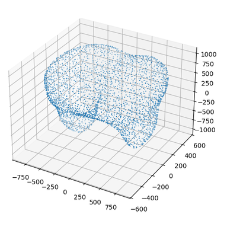

# Dentology: Topological Data Analysis for Dentists 🦷


Dentology applies cutting-edge mathematical tools to dental imaging, offering innovative methods for cavity detection and analysis.

## Cavity Detection Pipeline

The main feature of Dentology is the Cavity Detection Pipeline (CDP). It is a state-of-the-art tool for identifying cavities in dental X-ray images. It uses Topological Data Analysis (TDA) to detect cavities in a patient's teeth. More specifically, it uses the Mapper algorithm.

The workflow of the CDP is as follows:

1. **Feature Extraction**: Extract the patient's tooth to be analyzed and 3D scan it to create a point cloud.
2. **Mapper Algorithm**: Apply the Mapper algorithm to generate a graph representation of the point cloud.
3. **Cavity Detection**: Identify cavities in the patient's tooth based on the topological features of the Mapper graph.

---

## Upcoming Features

### Teeth Counting Pipeline

We are currently developing the Teeth Counting Pipeline (TCP). TCP is a cutting-edge tool for counting the number of teeth in a patient's mouth. It uses Persistent Homology to analyze the topological features of the patient's dental X-ray image. The TCP will also be able to inform the dentist if the patient has any teeth at all, saving valuable time and resources in these cases.

---

## Installation and Usage

### Clone the repository:

```bash
git clone https://github.com/odinhg/Dentology-TDA-for-Dentists 
cd Dentology-TDA-for-Dentists
pip install -r requirements.txt
```

### Generating Point Clouds

If the patient brings a 3D model of their teeth, you can generate a point cloud from it to use in the Cavity Detection Pipeline. Dentology provides a script to sample a point cloud from an STL file. To generate a point cloud from an STL file, you can use the `sample_point_cloud.py` script. For example:

```bash
python sample_point_clouds.py --filename data/stl/premolar_two_cavities.stl --n_points 3000 --output data/point_clouds/premolar_two_cavities.npy --plot
```

This will sample 3000 points from the STL file `data/stl/premolar_two_cavities.stl`, save the point cloud to `data/point_clouds/premolar_two_cavities.npy`, and plot the point cloud for visualization. Here is the full usage information for the script: 

```text
usage: sample_point_clouds.py [-h] [--filename FILENAME] [--n_points N_POINTS] [--output OUTPUT]
                              [--plot | --no-plot]

Sample a point cloud from STL file

options:
  -h, --help           show this help message and exit
  --filename FILENAME  Path to the STL file
  --n_points N_POINTS  Number of points to sample
  --output OUTPUT      Path to save the point cloud
  --plot, --no-plot    Plot the point cloud
```

| Input STL 3D Model | Output Point Cloud Sample |
|:------------:|:-------------------:|
|  |  |

### Running the Cavity Detection Pipeline

To run the Cavity Detection Pipeline, you can use the `cavity_detection.py` script. For example:

```bash
python cavity_detection.py --point_cloud data/point_clouds/premolar_two_cavities.npy --output data/cavity_detection_results/premolar_two_cavities.png
```

---

## Disclaimer
This tool is intended for research purposes only and should not replace professional dental care. Please visit your dentist regularly. Also, happy 1st of April! 


